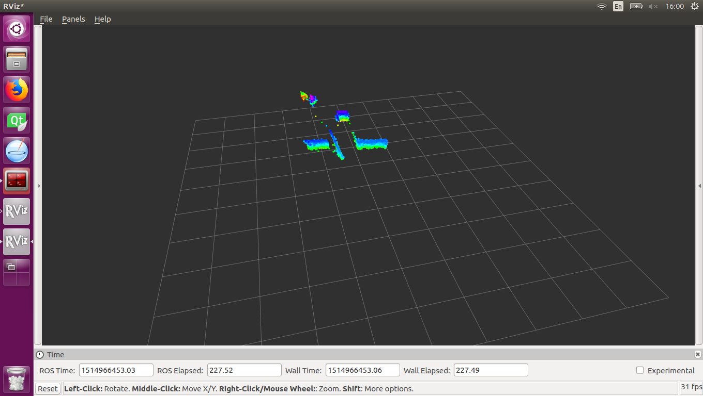

This page is set up for CE30-D SDK technical support. For product information about CE30 series and other Benewake products, please visit our [offical website](http://www.benewake.com/en/index.html).

---

#### Get Started

The `ce30_driver_ros` provides ROS interfaces to the `ce30_driver`. For more information about the `ce30_driver`, click [here](https://codincodee.github.io/ce30_driver).

#### Topics

|         Node         | I/O  | Topic Name  | Message Type                             | Description         |
| :------------------: | :--: | ----------- | ---------------------------------------- | ------------------- |
| ce30_driver_ros_node | Out  | ce30_points | [sensor_msgs::PointCloud](http://docs.ros.org/api/sensor_msgs/html/msg/PointCloud.html) | CE30-D Measurements |

#### Parameters

|         Node         |   Name   |  Type  | Default Value | Descriptions |
| :------------------: | :------: | :----: | :-----------: | :----------: |
| ce30_driver_ros_node | frame_id | String |     ce30      |   Frame ID   |

#### Version

- 1.0.1

#### Dependencies

- [ce30_driver](https://codincodee.github.io/ce30_driver) 1.0.6
- [ROS](http://www.ros.org/) Kinetic

#### Quick Access

- [Official Website](http://www.benewake.com/en/index.html)
- [ce30_driver](https://codincodee.github.io/ce30_driver)